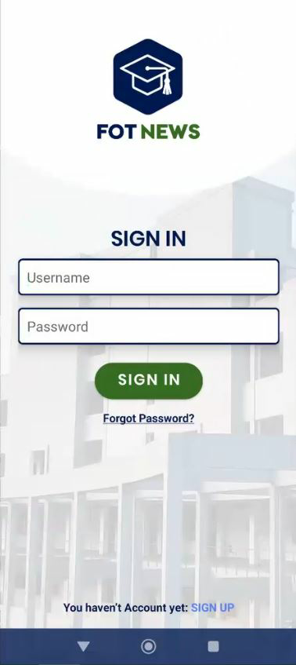
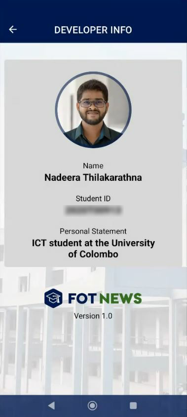
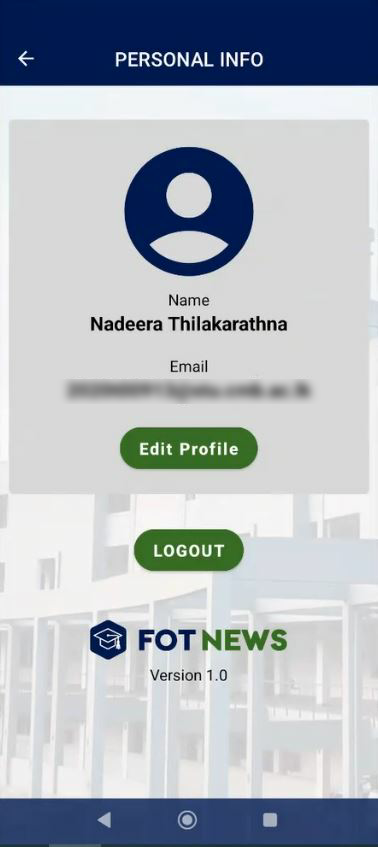
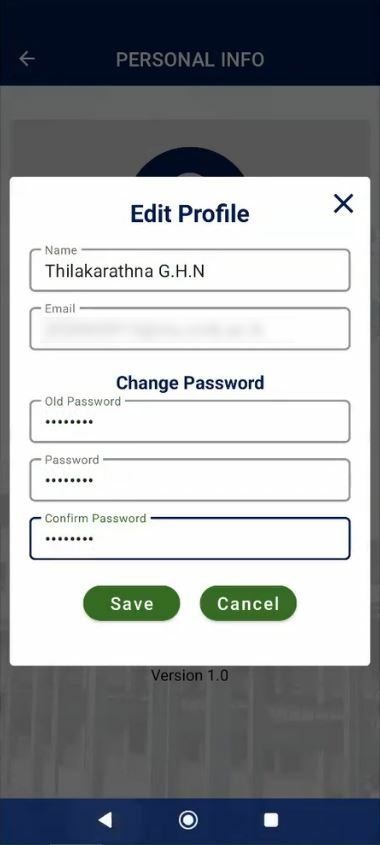
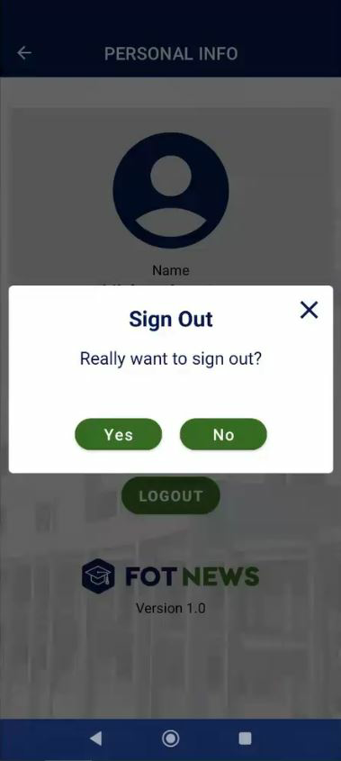
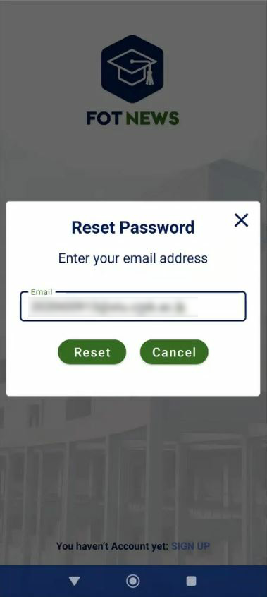

# 📱 FOT NEWS – User Guide

Welcome to **FOT NEWS**, the mobile app for keeping up with the latest news, updates, and events from the Faculty of Technology. This guide will walk you through how to use the app step by step.

---

## 🚀 Getting Started

### 1. Splash Screen
When you open the app, you’ll be greeted by the **Splash Screen** with the FOT NEWS logo and branding. 
It ensures you’ve landed in the right place before the experience begins.

---

### 2. Sign Up
New here? Create your account by providing your **Name, Email, and Password**.  
Once registered, you can log in anytime.

---

### 3. Login
Already have an account? Enter your **Email and Password** to access the news feed.  
Forgot your password? Use the **Forgot Password** option to recover.

---

## 📰 Exploring the App

### 4. All News
This is your main hub!  
- Browse the latest updates across **All, Sports, Academics, and Events**.  
- Each story comes with a **title, image, content, category, and time**.  
- Use the navigation bar to move between categories.  

---

### 5. Developer Info
Curious about who built this app? Head to the **Developer Info Screen** to learn more about the creator, their student ID, and app version details.

---

## 👤 Your Profile

### 6. Personal Info
Here, you can view your **profile information** including your name and email.  
From this screen, you can either update your details or log out.

---

### 7. Edit Profile
Need to make changes?  
Tap **Edit Profile** to update your **Name, Email, or Password**.  
Save the changes and you’re good to go!

---

### 8. Logout
Done for the day? Simply tap **Logout**.  
You’ll be asked to confirm before being redirected to the Login screen.

---

### 9. Forgot Password
If you've forgotten your password, tap the **Forgot Password?** link on the Login screen. Enter your registered Email to receive a password reset link. Follow the instructions in the email to set a new password and regain access.

---

## 🛠️ Development Tools
FOT NEWS was developed using the following tools and technologies:

-**Android Studio**: The integrated development environment (IDE) used to build the app.
-**Java**: The programming language used for the app’s core functionality.
-**Firebase**: The backend platform powering user authentication, and real-time updates.

